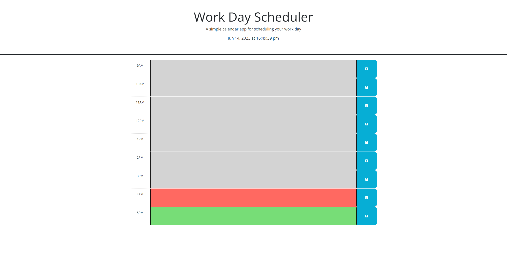

# Module 5 Challenge: Work Day Scheduler

# Description

This website is a daily schedule. The user can input appointments, meetings, etc. to the schedule on an hourly basis. This website offers a virtual way to plan out a typical 9-5 workday.

# Installation

N/A

# Usage

Navigate to the site. The top of the page updates the time and date to the second. The time blocks are color coded: gray is past, red is current, and green is future. Click the time block(s) you wish to enter an appointment and type. Click the save button to store the information. Any stored information will remain in the schedule until it is updated or the local storage is cleared.

url: https://mahlheim.github.io/laughing-umbrella/ 

    

# Credits

Below are websites that I referenced while building this site:

https://stackoverflow.com/questions/59995703/trying-to-change-background-color-based-off-if-the-hour-is-in-the-past-current

https://www.tutorialrepublic.com/faq/how-to-get-the-id-of-an-element-using-jquery.php#:~:text=Answer%3A%20Use%20the%20jQuery%20attr,alert%20box%20on%20button%20click.

# License 

Please refer to the license in the repo.
